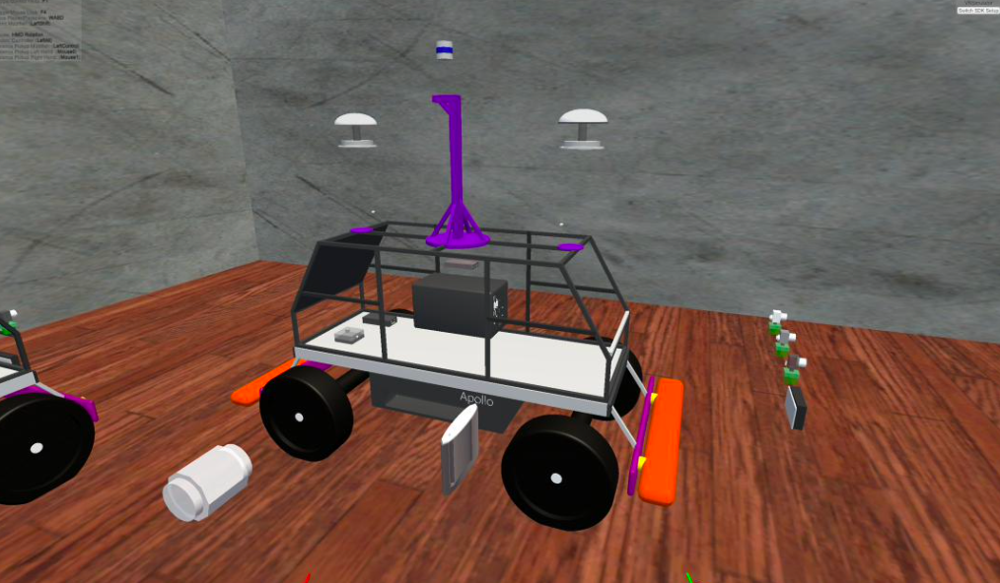

# Baidu-Apollo-VR

The implementation of Project: **Baidu-Apollo-VR**

</img>

## Introduction
VR technology is used to provide students with a platform for learning to assemble Baidu's Apollo driverless cars. During assembly, students can have a general understanding of the functions of each component and interface. It is convenient for students to access cutting-edge scientific knowledge. At the same time, it provides the input of learning and assembly time, which is convenient for teachers to supervise students' learning situation.
